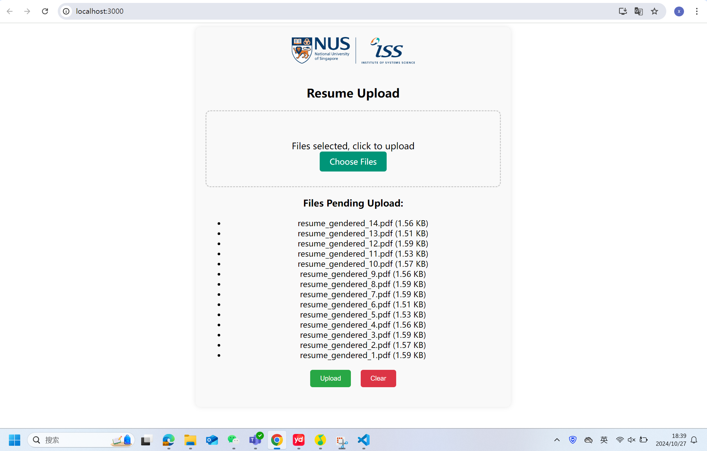
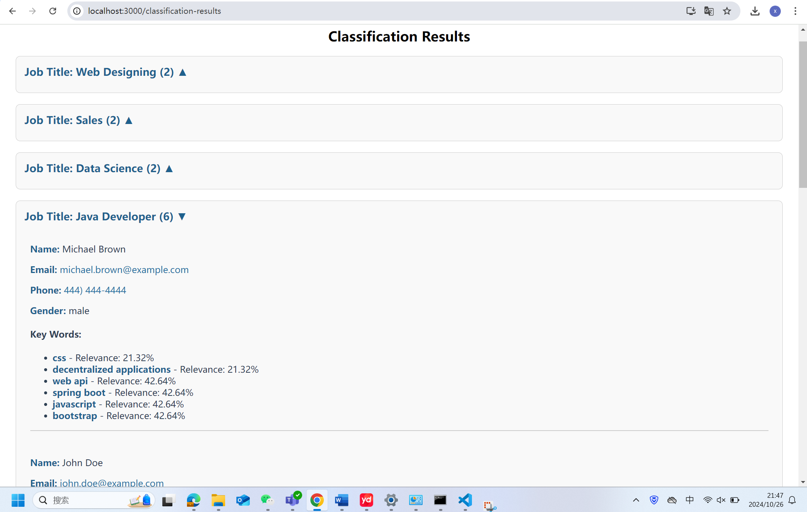


---

## SECTION 1 : PROJECT TITLE
## IntelliResume Classification and Job Recommendation System 





---

## SECTION 2 : EXECUTIVE SUMMARY / PAPER ABSTRACT
In today’s competitive job market, effectively matching candidates with the right job roles has become a critical yet challenging task for both job seekers and recruiters. Young professionals often struggle to find positions that align with their skills and career goals, leading to frustration and missed opportunities. Meanwhile, recruiters are faced with the tedious task of sifting through numerous resumes to identify top candidates, which can be both time-consuming and error-prone. Recognizing these challenges, our team of four aspiring professionals aimed to develop an AI-powered "Resume Classification and Recommendation System." This system is designed to improve resume screening efficiency for recruiters while providing job seekers with personalized recommendations to enhance their job search experience.

Our approach to building this system involved a comprehensive understanding of both job seekers' needs and recruiters' requirements. Through surveys and interviews, we gathered insights that informed the creation of a knowledge base for our recommendation engine. On the technical side, we used Java to scrape and compile job data from various online sources, creating a robust database of roles and skill requirements. For the recommendation engine, we utilized CLIPS for rule-based reasoning and combined it with natural language processing (NLP) for resume parsing and skills extraction. Python and React were then used to develop an accessible and user-friendly interface, hosted on a web platform, allowing users to interact seamlessly with the system.

The Resume Recognition and Recommendation System includes advanced features to optimize both the recruitment and job search process. Through NLP toolkits (such as NLTK, spaCy), the system parses resumes to identify key skills and experiences, categorizing them by industry relevance. Using the K-Nearest Neighbor (KNN) algorithm, it then matches these skills with job requirements, providing users with tailored job recommendations and relevance scores. Additionally, the system offers job seekers personalized feedback on their resumes and suggestions for skill improvement, equipping them with the insights needed to refine their job search strategy.


Working on this project has been a highly rewarding experience for our team, providing us with practical insights into the recruitment field and the potential of AI-driven solutions. We believe that our system not only addresses the current needs of job seekers and recruiters but also has significant potential for future expansion. In the long term, we envision enhancing the system with additional features, such as location preferences and salary expectations, to provide a more holistic job search experience. Our Resume Recognition and Recommendation System aims to bridge the knowledge gap in job matching, empowering users to make informed career choices while improving recruitment efficiency.

---

## SECTION 3 : CREDITS / PROJECT CONTRIBUTION

| Official Full Name  | Student ID (MTech Applicable)  | Work Items (Who Did What) | Email (Optional) |
| :------------ |:---------------:| :-----| :-----|
| Cheng Siyuan | A0287262X | software structure design, backend development, model deployment, backend data pre-processing and post-processing| e1285208@u.nus.edu |
| Qin Jiayu | A0296744M | Designed the system module, drew the system architecture diagram, wrote the team project report, and searched for data sets| e1350882@u.nus.edu|
| Wang Xiang | A0298765A | software structure design, frontend development，searched for data sets，System selection and Market demand analysis| e1352903@u.nus.edu |
| Zhu Yinge | A0295228W | Dataset Expansion and Cleaning,Training and Comparison of Multiple Models,Improvement in Name Recognition| e1349366@u.nus.edu |

---

## SECTION 4 : VIDEO OF SYSTEM MODELLING & USE CASE DEMO

[](https://youtu.be/-AiYLUjP6o8 "Sudoku AI Solver")

Note: It is not mandatory for every project member to appear in video presentation; Presentation by one project member is acceptable. 
More reference video presentations [here](https://telescopeuser.wordpress.com/2018/03/31/master-of-technology-solution-know-how-video-index-2/ "video presentations")

---

## SECTION 5 : USER GUIDE

`Refer to appendix <Installation & User Guide> in project report at Github Folder: ProjectReport`

### Technologies Used
- **Frontend**: React.js
- **Backend**: Flask
- **Machine Learning**: KNN algorithm

## Frontend & Backend Applications

The frontend is developed using the **React** framework, communicating with the backend via APIs developed in **Flask**. Users can upload their resume files from the frontend, and the backend processes these files, returning results in JSON format.

### Key Features
- Upload .pdf and .docx resume files.
- Extract personal information from resumes.
- Classify resumes into suitable job roles.
- Display classification results with detailed information.

## Deployment Instructions

### System Requirements
- **Operating System**: Windows 11
- **Python**: Ensure you have a working Python installation.

### Backend Setup
1. **Install Required Libraries**:
   Open a terminal and run:
   ```bash
   pip install Flask Flask-Cors PyPDF2 numpy pandas nltk scikit-learn python-docx
   ```

2. **Download NLTK Resources**:
   Open the Python shell and execute the following commands:
   ```python
   import nltk
   nltk.download('names')
   nltk.download('words')
   nltk.download('stopwords')
   nltk.download('punkt')
   nltk.download('averaged_perceptron_tagger')
   nltk.download('maxent_ne_chunker')
   exit()
   ```

3. **Run the Backend**:
   Navigate to the backend directory and start the server:
   ```bash
   cd <path_to_system>/Resume-Classification-System/SystemCode/backend
   python main.py
   ```

### Frontend Setup
1. **Install Node.js**: Make sure you have Node.js installed.

2. **Run the Frontend**:
   Open a new terminal and navigate to the frontend directory:
   ```bash
   cd <path_to_system>/Resume-Classification-System/SystemCode/frontend
   npm install
   npm start
   ```

3. **Access the Application**:
   Open your browser and navigate to [http://127.0.0.1:3000/](http://127.0.0.1:3000/). This is the home page where you can upload your resume.

### Using the System
- Click the “Choose Files” button to select one or more resumes.
- Click the “Upload” button to upload the selected resumes.
- Use the “Clear” button to remove and re-select files.

Once the classification is complete, you will be redirected to the results page, where:
- Classification results are grouped by the most suitable job titles.
- Click on job title cards to view details, including extracted information such as name, email, phone number, gender, and keywords from each resume.


## SECTION 6 : PROJECT REPORT / PAPER

`Refer to project report at Github Folder: ProjectReport`

**Recommended Sections for Project Report / Paper:**
- Executive Summary / Paper Abstract
- Sponsor Company Introduction (if applicable)
- Business Problem Background
- Market Research
- Project Objectives & Success Measurements
- Project Solution (To detail domain modelling & system design.)
- Project Implementation (To detail system development & testing approach.)
- Project Performance & Validation (To prove project objectives are met.)
- Project Conclusions: Findings & Recommendation
- Appendix of report: Project Proposal
- Appendix of report: Mapped System Functionalities against knowledge, techniques and skills of modular courses: MR, RS, CGS
- Appendix of report: Installation and User Guide
- Appendix of report: 1-2 pages individual project report per project member, including: Individual reflection of project journey: (1) personal contribution to group project (2) what learnt is most useful for you (3) how you can apply the knowledge and skills in other situations or your workplaces
- Appendix of report: List of Abbreviations (if applicable)
- Appendix of report: References (if applicable)

---
